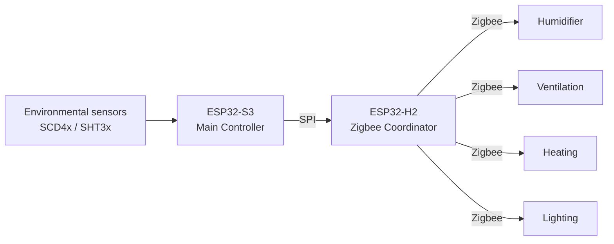

# 🍄 MycoBox

**Local-first climate automation for mushroom growing chambers.**

MycoBox is a standalone environmental controller designed to automate small and medium-sized mushroom growing chambers.

The project was created around a simple idea:

> The growing chamber should take care of its climate by itself.

Once configured, MycoBox continuously monitors environmental conditions and controls the equipment required to maintain the selected cultivation cycle — without depending on a cloud service or a permanently connected computer.

---

## What does it control?

MycoBox can manage the main environmental elements required for mushroom cultivation:

* relative humidity,
* air temperature,
* CO₂ concentration,
* ventilation,
* humidification,
* heating,
* lighting.

Environmental parameters can change throughout the cultivation cycle instead of remaining at a single fixed value.

The controller therefore acts more like a small grow-room automation system than a simple thermostat or humidity switch.

---

# Web interface

MycoBox contains its own local web server.

No external application or cloud account is required. The interface can be opened in a normal web browser from a phone, tablet or computer connected to the same local network.

## Dashboard

<p align="center">
  
</p>

The main interface provides a quick overview of the controller and the current state of the growing chamber.

It is designed to make the most important information available immediately without requiring the user to navigate through several configuration pages.

---

## Environmental sensors

<p align="center">
  
</p>

The sensor interface provides access to current environmental measurements and recorded history.

Depending on the installed sensor configuration, MycoBox can monitor:

* temperature,
* relative humidity,
* CO₂ concentration.

Historical measurements can be used to observe how the chamber reacts to humidification, ventilation, heating and other environmental changes.

---

## Cultivation cycles

<p align="center">
  
</p>

Environmental requirements are rarely constant during an entire mushroom grow.

MycoBox allows the cultivation process to be represented as a cycle containing days and time periods with configurable environmental targets.

This makes it possible to change chamber conditions automatically as the cultivation process progresses instead of manually adjusting the controller every day.

---

# System architecture

MycoBox uses two dedicated microcontrollers with clearly separated responsibilities.



The ESP32-S3 runs the cultivation logic, environmental monitoring and user interface.

The ESP32-H2 maintains the Zigbee network and communicates with compatible external actuators.

---

## ESP32-S3 — Main Controller

The ESP32-S3 is responsible for:

* cultivation logic,
* environmental measurements,
* Wi-Fi connectivity,
* local web interface,
* schedules and cultivation cycles,
* logging,
* local display and joystick interface,
* firmware management.

The Main Controller decides what should happen inside the chamber.

It does not directly switch the external mains-powered equipment.

---

## ESP32-H2 — Zigbee Controller

The ESP32-H2 operates as the dedicated Zigbee Coordinator.

It communicates with the Main Controller and provides the Zigbee network used to connect compatible external devices such as smart outlets controlling:

* humidifiers,
* fans,
* heaters,
* lights.

Separating the application controller from the Zigbee controller keeps radio communication independent from the main automation logic.

---

# Sensors

The controller supports environmental sensors suitable for high-humidity applications.

Current sensor support includes devices from the:

* Sensirion SCD4x family,
* Sensirion SHT3x family.

Depending on the installed sensor configuration, the controller can monitor:

* temperature,
* relative humidity,
* CO₂ concentration.

Measurements are stored by the controller and can be displayed as historical charts in the web interface.

---

# Humidity control

Humidity is one of the most important parameters inside a mushroom fruiting chamber.

MycoBox supports two approaches to humidification.

## Fixed cycle

The humidifier operates using configurable ON and OFF periods.

This provides simple and predictable timer-based control.

## Adaptive control

Adaptive mode uses recent humidity measurements, the target humidity and the current humidity trend to decide when humidification is required.

Instead of running the humidifier continuously, the controller uses controlled humidification pulses and allows the chamber to react before making the next correction.

The goal is to reduce large humidity oscillations and overshooting while still reacting quickly when the chamber moves away from its target.

---

# Cultivation cycles

Environmental requirements are rarely constant during an entire mushroom grow.

MycoBox allows the cultivation process to be represented as a cycle containing days and time periods with configurable environmental targets.

This makes it possible to create different climate conditions for different stages of cultivation without manually changing controller settings every day.

Cycles can be edited directly from the local web interface.

---

# Web interface features

The local interface provides access to the main MycoBox functions.

## Dashboard

Current controller status and basic system information.

## Sensors

Current and historical environmental measurements.

## Control

Climate-control configuration and cultivation-cycle management.

## Logs

Controller and device diagnostic information.

## Zigbee

Zigbee network management, device discovery, outlet testing and assignment of devices to controller functions.

## System

Network, time, localization, authentication and firmware settings.

---

# Local-first design

MycoBox is intentionally designed to operate without a mandatory cloud connection.

The controller itself contains:

* automation logic,
* configuration,
* cultivation schedules,
* sensor history,
* web interface.

Normal climate control is performed locally.

An internet connection may be useful for services such as time synchronization, but the controller does not depend on an external cloud platform to operate the chamber.

If an external online service disappears, the growing chamber should continue to work.

---

# Why Zigbee?

Grow chambers often require several mains-powered devices:

* humidifiers,
* circulation or exhaust fans,
* heating equipment,
* lighting.

Instead of permanently wiring every device directly into the controller, MycoBox uses Zigbee devices as remote actuators.

This provides several advantages:

* easier installation,
* electrical separation between the controller and mains-powered equipment,
* replaceable actuator devices,
* flexible physical placement,
* the ability to expand the installation without redesigning the Main Controller.

A compatible multi-outlet Zigbee device may also expose several independently controlled endpoints, allowing one physical device to control multiple chamber functions.

---

# Local control

The system is not limited to the web interface.

The Main Controller also supports a local display and joystick, allowing basic information to remain available directly on the device.

This means basic chamber information can still be inspected without opening a browser.

---

# Firmware updates

MycoBox contains two independently programmable controllers:

* ESP32-S3 Main Controller,
* ESP32-H2 Zigbee Controller.

Both can be updated from the MycoBox web interface.

Stable public firmware packages are distributed through the **Releases** section of this repository.

A release may contain:

```text
MycoBox-S3-OTA-vX.XXX.EN.bin
MycoBox-H2-vX.XXX.EN.bin
SHA256SUMS.txt
```

Not every release requires both controllers to be updated.

Always read the release notes before installing firmware.

Do not disconnect power while a firmware update is in progress.

See:

[**Firmware Update Guide →**](docs/firmware-update.md)

---

# Zigbee devices

The current MycoBox firmware supports Zigbee devices operating as switch-type actuators.

Typical examples include:

* smart plugs,
* relay modules,
* compatible multi-outlet power strips.

MycoBox can assign Zigbee outlets to:

* Humidifier,
* FAE / Fan,
* Light,
* Heatpad.

Devices can be paired, tested and assigned directly from the local web interface.

See:

[**Zigbee Setup Guide →**](docs/zigbee.md)

---

# Time and offline operation

MycoBox uses a hardware RTC as an offline time source.

When network time is available, NTP can be used as the reference.

The controller can therefore maintain time for:

* schedules,
* cultivation cycles,
* historical measurements,
* daily transitions,

even when an internet connection is unavailable.

---

# Similar commercial solutions

MycoBox belongs to the same general family of environmental-control systems as products such as:

### Contol-X Grow Room Controller

Commercial mushroom grow-room automation combining temperature, humidity and CO₂ monitoring with stage-based environmental control.

### AC Infinity Controller 69 Pro

A general indoor growing environment controller providing temperature- and humidity-based automation, schedules, cycles and independent device control.

### Inkbird IHC-200

A much simpler humidity controller demonstrating the basic concept of automatically switching external humidification equipment according to measured relative humidity.

MycoBox is not affiliated with these manufacturers.

The project approaches the same problem from a different direction: a local-first controller built around inexpensive, replaceable sensors and Zigbee devices rather than a proprietary equipment ecosystem.

---

# Project philosophy

The main design goals are:

### Autonomy

The grow chamber should continue operating without a cloud service or permanently connected computer.

### Modularity

Sensors, actuators and communication responsibilities should remain replaceable and clearly separated.

### Accessible hardware

Whenever possible, the system should use components that can be purchased independently rather than relying on a proprietary ecosystem.

### Local ownership

Configuration and control should remain available directly from the controller.

### Recoverability

Firmware should be upgradeable while keeping a documented path for service and recovery.

### Practical automation

The controller should solve the environmental problems that appear in an actual grow chamber rather than only display sensor readings.

---

# Documentation

Detailed documentation is available in the [`docs`](docs/) directory.

Currently available:

* [Getting Started](docs/getting-started.md)
* [Hardware Overview](docs/hardware-overview.md)
* [Zigbee Setup](docs/zigbee.md)
* [Firmware Updates](docs/firmware-update.md)

Additional documentation is being prepared for:

* User Guide
* Cultivation Cycles
* Web Interface
* Troubleshooting
* Safety

---

# Releases

Stable firmware versions are published using GitHub Releases.

Each public release describes:

* new features,
* changes,
* bug fixes,
* compatibility notes,
* firmware update requirements.

Firmware releases may contain separate images for the ESP32-S3 Main Controller and ESP32-H2 Zigbee Controller.

Only firmware explicitly published for MycoBox hardware should be installed.

[**View MycoBox Releases →**](https://github.com/Moffefe/MycoBox/releases)

---

# Repository scope

This public repository focuses on:

* product documentation,
* operating instructions,
* hardware information,
* compatibility information,
* firmware releases.

The firmware source code, production provisioning tools, encryption material and service recovery images are not published in this repository.

---

# Project status

MycoBox is an actively developed personal hardware and software project.

The controller is being developed alongside real hardware and a working grow-chamber automation system.

Features, hardware compatibility and documentation may continue to evolve between releases.

---

# Disclaimer

MycoBox controls external electrical equipment and environmental conditions.

The user is responsible for the electrical safety, suitability and correct installation of all connected equipment.

Do not exceed the electrical ratings of connected Zigbee outlets, relays or other switching devices.

Heating equipment, humidifiers, fans and other powered devices should never be left unattended until their configuration and automatic control have been verified.

---

# Copyright

Copyright © MycoBox project.

All rights reserved unless explicitly stated otherwise.
