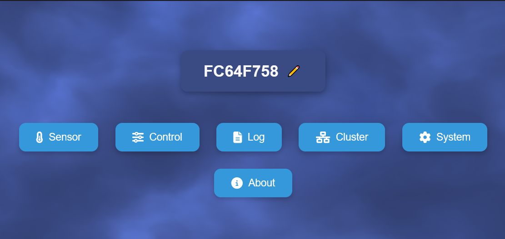
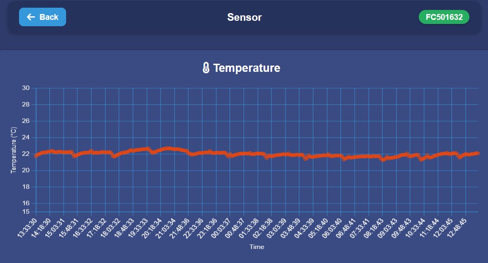
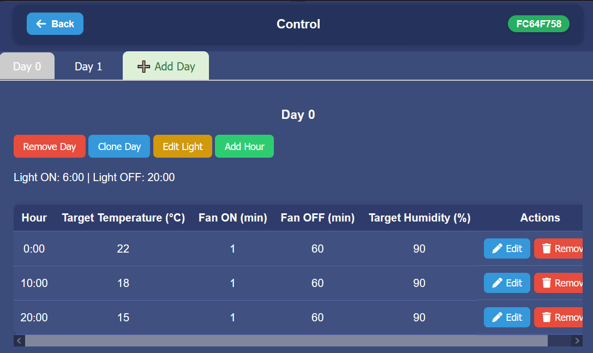
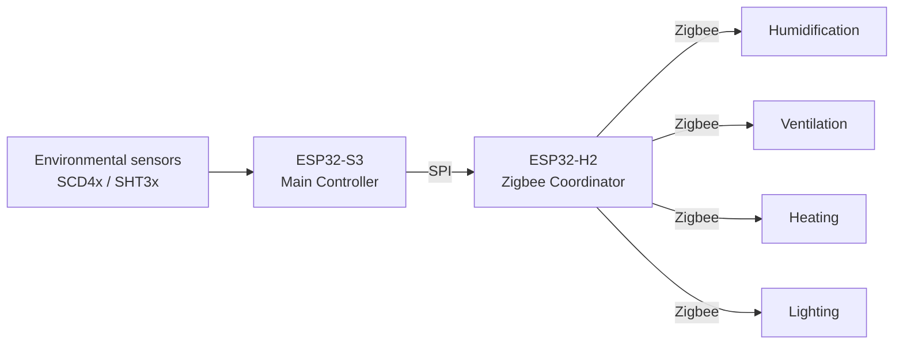

# 🍄 MycoBox

**Local-first climate automation for controlled environments.**

MycoBox is a standalone environmental controller designed to monitor and automate enclosed growing and climate-controlled spaces.

It can be used in applications such as:

* indoor plant growing and propagation,
* mushroom cultivation,
* terraria and vivaria,
* environmental and cultivation experiments,
* other enclosed spaces where temperature, humidity, CO₂ or equipment schedules need to be monitored or controlled.

Once configured, MycoBox continuously monitors environmental conditions and controls connected equipment locally — without requiring a cloud service or permanently connected computer.

---

## What can it monitor and control?

MycoBox can monitor:

* air temperature,
* relative humidity,
* CO₂ concentration.

It can automatically control:

* ventilation,
* humidification,
* heating,
* lighting.

The system can operate with simple fixed settings or use time-dependent environmental profiles when conditions need to change automatically.

---

# Web interface

MycoBox contains its own local web server.

No external application or cloud account is required. The interface can be opened using a normal web browser from a phone, tablet or computer connected to the same local network.

## Dashboard

<p align="center">
  
</p>

The main interface provides a quick overview of current environmental conditions and controller status.

---

## Environmental sensors

<p align="center">
  
</p>

The sensor interface provides access to current measurements and recorded history.

Depending on the installed sensor configuration, MycoBox can monitor:

* temperature,
* relative humidity,
* CO₂ concentration.

Historical data makes it possible to observe how the controlled environment reacts to humidification, ventilation, heating and other changes.

---

## Environmental profiles and cycles

<p align="center">
  
</p>

A MycoBox installation does not need to use changing environmental cycles.

For many applications, fixed target values and normal equipment schedules are sufficient.

When conditions need to change over time, MycoBox can organize environmental settings into days and time periods with different targets.

This can be useful for applications such as:

* day and night temperature changes,
* lighting schedules,
* changing humidity targets,
* different stages of plant growth,
* terrarium or vivarium day/night profiles,
* controlled environmental experiments.

The configured profile is executed locally by the controller.

---

# System architecture

MycoBox uses two dedicated microcontrollers with separate responsibilities.



The ESP32-S3 runs the environmental-control logic, sensor monitoring and user interface.

The ESP32-H2 maintains the Zigbee network and communicates with compatible external actuators.

---

## ESP32-S3 — Main Controller

The ESP32-S3 is responsible for:

* environmental-control logic,
* sensor measurements,
* Wi-Fi connectivity,
* local web interface,
* schedules and environmental profiles,
* logging,
* local display and joystick interface,
* firmware management.

The Main Controller decides when connected equipment should operate.

---

## ESP32-H2 — Zigbee Controller

The ESP32-H2 operates as the dedicated Zigbee Coordinator.

It provides the Zigbee network used to connect compatible external devices such as smart outlets controlling:

* humidifiers,
* fans,
* heaters,
* lights.

Separating Zigbee communication from the Main Controller keeps the radio network independent from the primary automation logic.

---

# Sensors

Current sensor support includes devices from the:

* Sensirion SCD4x family,
* Sensirion SHT3x family.

Depending on the installed sensor configuration, MycoBox can measure:

* temperature,
* relative humidity,
* CO₂ concentration.

Measurements can be stored by the controller and displayed as historical charts in the local web interface.

CO₂ is currently used as a monitored environmental parameter. Ventilation operates according to its configured control settings rather than directly regulating CO₂ concentration.

---

# Climate control

## Humidity

MycoBox supports two approaches to humidification.

### Fixed cycle

The humidifier operates using configurable ON and OFF periods.

This provides simple and predictable timer-based operation.

### Adaptive control

Adaptive mode uses recent humidity measurements, the configured target and the current humidity trend to decide when humidification is required.

Instead of continuously running the humidifier until the target is reached, the controller uses controlled pulses and gives the environment time to react before making another correction.

This can help reduce large humidity oscillations and overshooting.

---

## Ventilation

A Zigbee-controlled fan can be assigned to the ventilation function.

Ventilation operates according to the configured ON and OFF timing settings.

This allows controlled air exchange without requiring the fan to remain permanently active.

---

## Heating

Compatible Zigbee switching devices can be assigned to heating equipment such as heating mats or other externally controlled heaters.

The electrical ratings and safety requirements of the connected equipment must always be respected.

---

## Lighting

Lighting can be controlled through a dedicated Zigbee binding and included in time-dependent schedules.

This allows MycoBox to handle applications where light periods or day/night operation are important.

---

# Local-first operation

The controller itself contains:

* automation logic,
* configuration,
* environmental schedules,
* sensor history,
* web interface.

Normal environmental control is performed locally.

An internet connection may be useful for services such as network time synchronization, but MycoBox does not require an external cloud platform for normal operation.

---

# Why Zigbee?

Controlled environments often use several mains-powered devices.

Typical examples include:

* humidifiers,
* circulation or exhaust fans,
* heating equipment,
* lighting.

Instead of permanently wiring every device directly into the controller, MycoBox uses Zigbee devices as remote actuators.

This provides:

* easier installation,
* electrical separation between the controller and mains-powered equipment,
* replaceable actuator devices,
* flexible physical placement,
* straightforward expansion of the installation.

Compatible multi-outlet Zigbee devices may expose several independently controlled endpoints, allowing one physical device to control multiple functions.

---

# Local control

The system is not limited to the web interface.

The Main Controller also supports a local display and joystick, allowing basic information to remain available directly on the device.

---

# Timekeeping

MycoBox uses a hardware RTC as an offline time source.

When network time is available, NTP can be used as a reference.

Reliable local time is used for:

* equipment schedules,
* environmental profiles,
* measurement history,
* day transitions.

Time-dependent control can therefore continue even when internet access is unavailable.

---

# Zigbee devices

The current MycoBox firmware supports Zigbee devices operating as switch-type actuators.

Typical examples include:

* smart plugs,
* relay modules,
* compatible multi-outlet power strips.

MycoBox can currently assign Zigbee outlets to:

* Humidifier,
* FAE / Fan,
* Light,
* Heatpad.

Devices can be paired, tested and assigned directly from the local web interface.

See:

[**Zigbee Setup Guide →**](docs/zigbee.md)

---

# Firmware updates

MycoBox contains two independently programmable controllers:

* ESP32-S3 Main Controller,
* ESP32-H2 Zigbee Controller.

Both can be updated from the MycoBox web interface.

Stable public firmware packages are distributed through the **Releases** section of this repository.

A release may contain:

```text
MycoBox-S3-OTA-vX.XXX.EN.bin
MycoBox-H2-vX.XXX.EN.bin
SHA256SUMS.txt
```

Not every release requires both controllers to be updated.

Always read the release notes before installing firmware and do not disconnect power while an update is in progress.

[**Firmware Update Guide →**](docs/firmware-update.md)

---

# Documentation

Detailed documentation is available in the [`docs`](docs/) directory.

Currently available:

* [Getting Started](docs/getting-started.md)
* [Hardware Overview](docs/hardware-overview.md)
* [Zigbee Setup](docs/zigbee.md)
* [Firmware Updates](docs/firmware-update.md)
* [Troubleshooting](docs/troubleshooting.md)
* [Safety](docs/safety.md)

Additional user documentation will be added as the project develops.

---

# Releases

Stable firmware versions are published using GitHub Releases.

Release notes describe relevant changes, compatibility information and firmware update requirements.

[**View MycoBox Releases →**](https://github.com/Moffefe/MycoBox/releases)

---

# Safety

MycoBox can control external electrical equipment and environmental conditions.

The user is responsible for the electrical safety, suitability and correct installation of all connected equipment.

Do not exceed the electrical ratings of connected Zigbee outlets, relays or other switching devices.

Heating equipment, humidifiers, fans and other powered devices should be tested before being used for unattended automatic control.

MycoBox should not be treated as a certified safety or life-support system.

For additional guidance, see:

[**Safety Guide →**](docs/safety.md)
