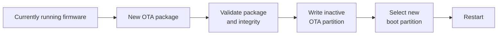

# Firmware Updates

MycoBox contains two independent microcontrollers and therefore uses two separate firmware components:

* **ESP32-S3 — Main Controller**
* **ESP32-H2 — Zigbee Controller**

Both controllers can be updated from the MycoBox web interface.

You normally do not need to connect either controller to a computer or use a USB programming tool.

---

# Before updating

Firmware updates temporarily interrupt normal environmental control.

Before starting an update:

* make sure MycoBox has stable power,
* use a reliable local Wi-Fi connection,
* keep the browser page open,
* do not restart the controller,
* do not disconnect power,
* make sure the controlled environment can tolerate temporary loss of automation,
* download firmware only from the official MycoBox release page.

Official firmware releases are available at:

[MycoBox Releases](https://github.com/Moffefe/MycoBox/releases)

Read the release notes before installing a new version.

Some releases may update only the Main Controller, while others may include firmware for both controllers.

Not every release requires both firmware files to be installed.

---

# Firmware files

A MycoBox release may contain separate firmware files for the two processors.

A typical release may contain:

```text
MycoBox-S3-OTA-vX.XXX.EN.bin
MycoBox-H2-vX.XXX.EN.bin
SHA256SUMS.txt
```

Always use the file identified for the correct controller.

Do not interchange S3 and H2 firmware files.

---

## Main Controller firmware

The ESP32-S3 does **not** accept an ordinary ESP32 application binary through the web updater.

MycoBox uses a dedicated encrypted OTA package containing firmware prepared for the controller's OTA partitions.

Use only the file marked as:

**Main Controller / ESP32-S3 OTA**

Do not use:

* development firmware,
* plain application binaries,
* Zigbee Controller firmware,
* recovery images.

The web interface validates the firmware package before installation.

---

## Zigbee Controller firmware

The ESP32-H2 updater uses a complete flash image.

The firmware file must be exactly:

```text
2,097,152 bytes
```

or:

```text
2 MiB
```

Use only the file marked as:

**Zigbee Controller / ESP32-H2**

The web interface checks the image size before starting the update.

---

# Updating the Main Controller

Open the MycoBox web interface and go to:

**System → Firmware**

The page displays the currently installed:

* application version,
* firmware build date.

---

## 1. Download the firmware

Download the Main Controller OTA file from the appropriate MycoBox release.

The file should have the `.bin` extension.

Do not rename another firmware image and attempt to use it as an S3 OTA package.

The updater also validates the internal package format.

---

## 2. Select the firmware

Press:

**Choose firmware**

Select the ESP32-S3 OTA firmware file.

The selected file name and size will appear next to the upload control.

---

## 3. Start the update

Press:

**Update Main Controller**

MycoBox will ask for confirmation.

Before confirming, make sure the controller will remain powered for the entire operation.

---

## 4. Firmware transfer

The browser transfers the firmware to the controller.

A progress bar shows the transfer progress.

During this stage:

> Keep the page open and do not disconnect power.

Reaching **100%** means that the browser has finished transferring the firmware.

It does **not** mean that the complete update procedure has finished.

---

## 5. Verification and installation

After the upload reaches 100%, MycoBox displays:

**Firmware transfer complete — verifying and installing...**

The Main Controller then verifies the encrypted firmware package and prepares the new firmware for boot.

This stage may take additional time.

Do not:

* close the browser page,
* restart MycoBox,
* disconnect power.

---

## 6. Automatic restart

After successful verification and installation, the Main Controller automatically restarts.

The web interface will attempt to reload automatically.

Wait until MycoBox becomes available again.

Depending on the local network, reconnecting may take several seconds.

---

# How the Main Controller update works

The ESP32-S3 uses an OTA partition system.

A simplified update flow looks like this:



The currently running firmware is not overwritten directly.

The new firmware is written to the inactive OTA partition.

Only after the package has been received and successfully verified does MycoBox configure the new partition for the next boot.

This reduces the risk of leaving the Main Controller without a bootable application when an update fails before completion.

---

# If the Main Controller update fails

If MycoBox reports:

**Firmware update failed**

do not repeatedly restart or power-cycle the controller.

Read the error message displayed by the web interface.

If communication was interrupted before the firmware was successfully installed, the previously running firmware should normally remain active.

Reconnect to the controller and try the update again using the correct firmware package.

Common causes include:

* incorrect firmware file,
* damaged or incomplete download,
* interrupted Wi-Fi connection,
* incompatible firmware package.

If MycoBox continues to operate normally after the failed update, there is usually no need for recovery firmware.

For additional diagnostic steps, see:

[Troubleshooting](troubleshooting.md)

---

# Updating the Zigbee Controller

The ESP32-H2 is updated through the ESP32-S3 Main Controller.

You do not upload the H2 firmware directly to the Zigbee Controller.

Instead:

```text
Browser
   │
   ▼
ESP32-S3 Main Controller
   │
   │ programming connection
   ▼
ESP32-H2 Zigbee Controller
```

Open:

**System → Zigbee**

Scroll to:

**Zigbee Controller Firmware**

The page displays the currently detected:

* Zigbee Controller firmware version,
* build date.

---

# Important difference

Updating the Zigbee Controller is more invasive than updating the Main Controller.

During the operation, the ESP32-S3 places the ESP32-H2 into programming mode and rewrites the complete H2 flash image.

Because the entire Zigbee Controller firmware is being replaced, interruption during this operation may leave the ESP32-H2 unable to start normally.

> Do not disconnect power during an ESP32-H2 update.

If an H2 update is interrupted, firmware recovery may be required.

---

# Zigbee network after an H2 update

Updating the ESP32-H2 resets the Zigbee network state.

Previously paired Zigbee devices must therefore be paired again after the update.

After updating H2, plan to:

```text
Update H2 firmware
        ↓
Wait for H2 restart
        ↓
Open Zigbee network
        ↓
Pair Zigbee devices again
        ↓
Verify device endpoints
        ↓
Review MycoBox bindings
        ↓
Test ON / OFF
```

Do not return the installation to unattended automatic operation until the Zigbee devices and actuator assignments have been verified again.

---

# H2 update procedure

## 1. Download the firmware

Download the Zigbee Controller firmware from the appropriate MycoBox release.

Use the firmware identified for:

**ESP32-H2 / Zigbee Controller**

The file must be exactly:

```text
2,097,152 bytes
```

---

## 2. Open the Zigbee page

Go to:

**System → Zigbee**

Find:

**Zigbee Controller Firmware**

---

## 3. Select the firmware

Press:

**Choose firmware**

Select the ESP32-H2 firmware file.

The web interface checks that the selected image meets the expected firmware requirements before programming begins.

---

## 4. Start the update

Press:

**Update Zigbee Controller**

Confirm the warning.

At this point:

* keep the web page open,
* keep MycoBox powered,
* do not restart the Main Controller.

---

## 5. Firmware transfer

The browser first transfers the H2 firmware image to the Main Controller.

The progress bar shows the transfer progress.

Do not interpret 100% as completion.

At 100%, the browser transfer has finished, but MycoBox may still be programming the ESP32-H2.

---

## 6. Finalizing the update

After the browser transfer completes, the interface displays:

**Firmware transfer complete — finalizing update...**

During this stage, MycoBox is completing the ESP32-H2 programming process.

This stage is critical.

Do not:

* disconnect power,
* close the page,
* restart the Main Controller.

---

## 7. H2 restart

After successful programming, the ESP32-H2 automatically restarts.

The web interface will indicate that the Zigbee Controller update completed successfully.

The page then reloads.

Verify that the Zigbee Controller firmware version and build information are available again.

---

# Pair Zigbee devices again

After a successful H2 update, open the Zigbee network and pair the required devices again.

See:

[Zigbee Setup](zigbee.md)

After pairing, test every controlled output.

Verify:

* Humidifier,
* FAE / Fan,
* Light,
* Heatpad.

Also verify the correct endpoint for each assigned device.

Do not assume that the system is ready for unattended operation simply because the firmware update succeeded.

---

# Updating both controllers

A release may contain firmware for both the ESP32-S3 and ESP32-H2.

Check the release notes before installing it.

The release notes will indicate:

* which controller needs updating,
* whether both firmware files are required,
* whether a specific update order is required,
* whether Zigbee devices must be configured again,
* any additional migration instructions.

Do not install an H2 image simply because a release contains one unless the release instructions require it.

---

# Version verification

After updating, verify the reported firmware information.

For the Main Controller:

**System → Firmware**

Check:

* App Version
* Build Date

For the Zigbee Controller:

**System → Zigbee → Zigbee Controller Firmware**

Check:

* Firmware Version
* Build Date

Compare these values with the release notes.

---

# Firmware file integrity

Public releases may include:

```text
SHA256SUMS.txt
```

This file contains SHA-256 checksums for the published firmware assets.

For additional verification, compare the checksum of the downloaded firmware file with the value provided in the release.

A mismatching checksum indicates that the file should not be used.

---

# Recovery firmware

Recovery firmware is different from normal web-update firmware.

A recovery image may contain a complete controller flash layout and is intended for service or recovery operations.

Recovery images must **not** be uploaded through the normal Main Controller OTA interface.

Normal users should use only firmware explicitly marked for web-based updating.

If a controller cannot boot after a failed update, follow the applicable recovery procedure or contact the project maintainer.

---

# Firmware file summary

| File type                     | Controller | Web update | Notes                                   |
| ----------------------------- | ---------- | ---------- | --------------------------------------- |
| Main Controller OTA package   | ESP32-S3   | Yes        | Normal S3 update file                   |
| Zigbee Controller 2 MiB image | ESP32-H2   | Yes        | Full H2 flash image                     |
| S3 recovery image             | ESP32-S3   | No         | Service/recovery only                   |
| Development/plain firmware    | S3 / H2    | No         | Not intended for production web updates |

---

# Safety checklist

Before pressing **Update**:

```text
[ ] Correct controller selected
[ ] Correct firmware release selected
[ ] Correct firmware file selected
[ ] Stable controller power
[ ] Stable local Wi-Fi connection
[ ] Browser page will remain open
[ ] Controlled environment can tolerate temporary loss of automation
```

For an H2 update, additionally confirm:

```text
[ ] I can pair the Zigbee devices again afterwards
[ ] I know which physical device belongs to each MycoBox function
[ ] I can verify the correct endpoint for each controlled output
```

For additional precautions, see:

[Safety](safety.md)

---

# Recommended update workflow

For normal users:

```text
1. Open the MycoBox GitHub Releases page
        ↓
2. Read the release notes
        ↓
3. Download only the required firmware file
        ↓
4. Open the appropriate MycoBox firmware page
        ↓
5. Upload the firmware
        ↓
6. Wait for successful completion
        ↓
7. Verify the reported version
        ↓
8. Test controlled equipment
```

Firmware updates should not be performed immediately before leaving the installation unattended.

---

# If something goes wrong

If an update fails:

1. Read the error shown by MycoBox.
2. Do not repeatedly power-cycle the controller.
3. Verify that the correct firmware file was selected.
4. Confirm that the downloaded file is complete.
5. Check whether the affected controller still starts normally.
6. Follow the appropriate troubleshooting procedure before attempting recovery.

See:

[Troubleshooting](troubleshooting.md)

---

# Related documentation

* [Getting Started](getting-started.md)
* [Hardware Overview](hardware-overview.md)
* [Zigbee Setup](zigbee.md)
* [Troubleshooting](troubleshooting.md)
* [Safety](safety.md)
