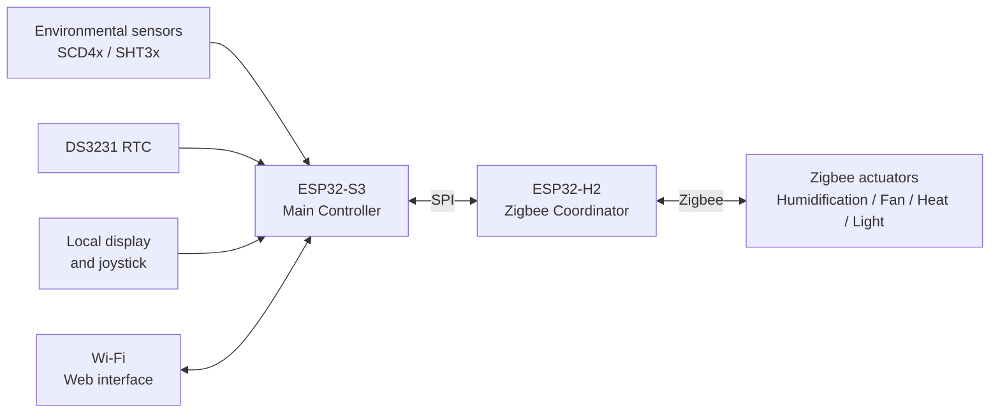

# Hardware Overview

MycoBox is a local environmental-control system built around two ESP32 microcontrollers.

The architecture separates the main automation logic from the Zigbee radio network.

This allows the Main Controller to focus on measurements, schedules and control decisions while a dedicated controller handles communication with external Zigbee devices.

---

# System architecture



---

# ESP32-S3 Main Controller

The ESP32-S3 is the primary application processor.

It is responsible for:

* environmental measurements,
* automation logic,
* Wi-Fi connectivity,
* the local web interface,
* time-based schedules,
* environmental profiles,
* historical data,
* local display operation,
* user input,
* firmware management,
* communication with the Zigbee Controller.

The Main Controller determines when connected equipment should operate.

External mains-powered devices are controlled through Zigbee actuators rather than directly from the ESP32-S3.

---

# ESP32-H2 Zigbee Controller

The ESP32-H2 operates as the Zigbee Coordinator.

Its main responsibilities are:

* maintaining the Zigbee network,
* allowing compatible devices to join,
* tracking supported paired devices,
* sending ON/OFF commands to Zigbee switch endpoints,
* providing Zigbee device information to the Main Controller.

The ESP32-S3 and ESP32-H2 communicate through an internal SPI connection.

This separation keeps the Zigbee radio subsystem independent from Wi-Fi connectivity and the main environmental-control logic.

---

# Environmental sensors

Current MycoBox firmware supports sensors from the:

* Sensirion SCD4x family,
* Sensirion SHT3x family.

Depending on the installed hardware, these sensors can provide measurements including:

* temperature,
* relative humidity,
* CO₂ concentration.

The environmental sensors are connected directly to the Main Controller.

Temperature and humidity can be used by automatic control functions.

CO₂ is currently available as a monitored environmental parameter and can be displayed and recorded by MycoBox.

For SCD4x installations, MycoBox provides configurable altitude compensation from 0–3000 m. The value is configured from **System → Environmental Sensor** and is applied when the SCD4x is initialized for CO₂ pressure compensation.

This altitude setting does not affect SHT3x sensors.

For sensor limitations and tested hardware, see:

[Compatibility](compatibility.md)

---

# Real-time clock

MycoBox uses a DS3231 real-time clock.

Network time can be used as the reference when available, while the RTC provides local time when network synchronization is unavailable.

Reliable time is important for:

* lighting schedules,
* equipment schedules,
* environmental profiles,
* historical measurements,
* day transitions.

The system can therefore continue time-dependent operation without continuous internet access.

---

# Local user interface

The Main Controller supports a local display and joystick.

This interface allows basic controller information to remain available directly on the device without requiring a phone or computer.

More detailed configuration is performed through the local web interface.

---

# Wi-Fi and web interface

The ESP32-S3 provides Wi-Fi connectivity and hosts the MycoBox web interface locally.

A normal browser can be used to:

* monitor environmental measurements,
* review historical data,
* configure control settings,
* configure time-dependent profiles,
* manage Zigbee devices,
* change network and system settings,
* update firmware.

A cloud service is not required for normal operation.

---

# Zigbee actuators

External equipment is controlled using compatible Zigbee switch-type devices.

Typical actuator hardware includes:

* smart plugs,
* relay modules,
* multi-outlet power strips.

These can be assigned to MycoBox functions such as:

* humidification,
* ventilation,
* lighting,
* heating.

Using external Zigbee switching devices keeps mains-voltage switching physically separate from the Main Controller.

It also allows individual actuators to be replaced without redesigning the controller hardware.

Current MycoBox bindings are:

* **Humidifier**
* **FAE / Fan**
* **Light**
* **Heatpad**

---

# Example installations

The same MycoBox hardware can be adapted to different controlled environments.

## Indoor growing enclosure

```text
Indoor growing enclosure
├── Temperature / humidity sensor
├── Grow light
├── Ventilation fan
└── Humidifier
```

## Mushroom fruiting chamber

```text
Mushroom fruiting chamber
├── Temperature / humidity / CO₂ sensor
├── Humidifier
├── Fresh-air fan
└── Lighting
```

## Terrarium or vivarium

```text
Terrarium / vivarium
├── Temperature / humidity sensor
├── Heating equipment
├── Lighting
└── Ventilation
```

The required equipment depends on the application.

Not every MycoBox installation needs to use every available control function.

---

# Multi-outlet Zigbee devices

Some Zigbee devices expose several independently controlled endpoints.

For example:

```text
Zigbee power strip
├── Endpoint 1 → Humidifier
├── Endpoint 2 → Fan
├── Endpoint 3 → Light
└── Endpoint 4 → Heating
```

This can reduce the number of separate smart plugs required for an installation.

Endpoint numbering is determined by the Zigbee device manufacturer and does not necessarily match the physical outlet numbering.

The current MycoBox Zigbee switch controller supports switch endpoints:

```text
1 through 6
```

Always test each endpoint manually before enabling automatic control.

See:

[Zigbee Setup](zigbee.md)

and:

[Compatibility](compatibility.md)

---

# Control path

A typical automatic control path looks like this:

```text
Environmental measurement / schedule
                │
                ▼
        ESP32-S3 control logic
                │
                ▼
          Zigbee binding
                │
                ▼
              SPI
                │
                ▼
             ESP32-H2
                │
                ▼
             Zigbee
                │
                ▼
        Smart plug / relay
                │
                ▼
      Environmental equipment
```

This separation means that MycoBox automation works with logical functions such as **Humidifier** or **Heatpad**, while the Zigbee configuration determines which physical device and endpoint performs that function.

---

# Network operation

MycoBox is designed for local operation.

The Wi-Fi connection is used to provide access to the web interface and optional network services such as time synchronization.

Normal control logic runs on the controller itself.

If internet access is unavailable, local environmental automation can continue.

If the configured Wi-Fi network cannot be reached, MycoBox can use its own Access Point mode for network configuration and recovery.

See:

[Getting Started](getting-started.md)

and:

[Troubleshooting](troubleshooting.md)

---

# Firmware components

MycoBox contains two separate firmware components.

```text
ESP32-S3
└── Main Controller firmware

ESP32-H2
└── Zigbee Controller firmware
```

Each controller can be updated independently.

A public release may therefore contain firmware for only one controller or for both.

The ESP32-S3 uses a dedicated OTA update package.

The ESP32-H2 uses a complete firmware image programmed through the Main Controller.

See:

[Firmware Updates](firmware-update.md)

---

# Safety considerations

MycoBox can control mains-powered environmental equipment.

The controller itself should not be treated as the only protection against unsafe conditions.

In particular:

* respect the electrical ratings of Zigbee switching devices,
* keep electrical equipment away from water and condensation,
* use independent protection for heating equipment where appropriate,
* manually verify every Zigbee endpoint before enabling automation,
* observe a new or modified installation before unattended operation.

See:

[Safety](safety.md)

---

# Related documentation

* [Getting Started](getting-started.md)
* [Compatibility](compatibility.md)
* [Zigbee Setup](zigbee.md)
* [Firmware Updates](firmware-update.md)
* [Troubleshooting](troubleshooting.md)
* [Safety](safety.md)