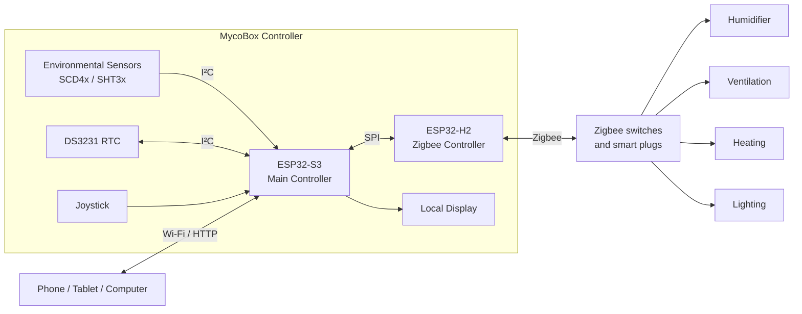

# Hardware Overview

MycoBox is built around two cooperating ESP32 microcontrollers.

The system intentionally separates the main automation logic from Zigbee communication:

* **ESP32-S3** runs the main application, web interface, sensors and climate-control logic.
* **ESP32-H2** operates as the dedicated Zigbee coordinator.
* The two controllers communicate through an internal **SPI bridge**.

This separation keeps the Zigbee network independent from the higher-level cultivation logic while still allowing the Main Controller to manage connected devices.

---

## System architecture



The controller itself does not need to switch mains voltage directly.

Instead, external equipment can be connected through compatible Zigbee switching devices.

---

## ESP32-S3 — Main Controller

The ESP32-S3 is the central processor of MycoBox.

It is responsible for the high-level behavior of the system.

Its main responsibilities include:

* reading environmental sensors,
* maintaining cultivation schedules,
* humidity control,
* ventilation control,
* heating control,
* lighting control,
* Wi-Fi connectivity,
* local web interface,
* historical measurements and logs,
* time synchronization,
* local display,
* joystick input,
* communication with the ESP32-H2,
* firmware management.

The S3 therefore acts as the main source of decisions inside MycoBox.

The Zigbee controller does not decide when a humidifier, fan or heater should operate. Those decisions are made by the Main Controller and then sent to the Zigbee subsystem.

---

## ESP32-H2 — Zigbee Controller

The ESP32-H2 is dedicated to Zigbee communication.

It operates as the **Zigbee Coordinator** for the MycoBox network.

Its responsibilities include:

* creating and maintaining the Zigbee network,
* pairing Zigbee devices,
* discovering connected devices,
* communicating with Zigbee switches,
* executing commands received from the Main Controller,
* reporting Zigbee information back to the Main Controller.

The currently active control path is based around Zigbee switch devices.

This makes ordinary Zigbee smart plugs and switching modules suitable as actuators for equipment such as humidifiers, fans, heaters and lights.

---

## Communication between the controllers

The ESP32-S3 and ESP32-H2 are connected through an internal SPI communication bridge.

```text
ESP32-S3
   │
   │  SPI
   │
ESP32-H2
   │
   │  Zigbee
   │
External devices
```

The ESP32-S3 acts as the main application controller.

When the climate-control logic decides that an external device should change state, the request is sent through the SPI bridge to the ESP32-H2.

The H2 then performs the required operation on the Zigbee network.

This architecture keeps two very different responsibilities separate:

```text
Cultivation logic      → ESP32-S3
Zigbee communication   → ESP32-H2
```

---

## Environmental sensors

MycoBox uses digital environmental sensors connected to the Main Controller.

The current implementation supports the Sensirion:

* **SCD4x family**
* **SHT3x family**

These sensor families are suitable for measuring the environmental parameters required inside a growing chamber.

Depending on the installed sensor configuration, MycoBox can monitor:

* temperature,
* relative humidity,
* CO₂ concentration.

The sensor subsystem is connected to the ESP32-S3 through I²C.

The same I²C bus is shared by other internal peripherals and access to it is coordinated by the Main Controller.

---

## Real-time clock

MycoBox contains a **DS3231 real-time clock**.

The controller uses two complementary time sources:

```text
Internet available
        │
        ▼
       NTP
        │
        ▼
  MycoBox system time
        │
        ▼
      DS3231
```

When network synchronization is available, NTP provides the reference time.

The RTC provides an offline fallback so the controller can maintain meaningful time even when an internet connection is unavailable.

Accurate time is important for:

* cultivation schedules,
* lighting periods,
* day transitions,
* historical measurements,
* event logs.

---

## Local user interface

MycoBox can be operated without a permanently connected phone or computer.

The Main Controller supports:

* a local display,
* a five-direction joystick.

The local interface is intended to provide essential controller information directly on the device.

More advanced configuration is performed through the web interface.

---

## Wi-Fi and web interface

Wi-Fi connectivity is handled directly by the ESP32-S3.

The controller contains its own HTTP server, so the user interface is served directly by MycoBox.

```text
Phone / Tablet / Computer
            │
          Wi-Fi
            │
            ▼
        ESP32-S3
            │
            ▼
     MycoBox Web UI
```

No external application server is required.

When connected to the local network, a browser communicates directly with the controller.

During initial setup or network recovery, MycoBox can also create its own Wi-Fi access point.

---

## Zigbee actuators

MycoBox uses Zigbee switching devices as remote actuators.

A typical installation can therefore look like:

```text
MycoBox
   │
   └── Zigbee
        │
        ├── Smart Plug → Humidifier
        ├── Smart Plug → Exhaust Fan
        ├── Smart Plug → Heater
        └── Smart Plug → Lighting
```

The exact equipment connected to a smart plug is not important to the Zigbee network.

MycoBox assigns a logical purpose to the outlet, for example:

```text
Zigbee device 0x1234 → Humidifier
Zigbee device 0x5678 → Ventilation
```

The cultivation logic can then operate the assigned function without needing to know the physical location of the outlet.

---

## Why not control mains equipment directly?

One of the design goals of MycoBox is to keep mains-voltage switching outside the main controller whenever practical.

Using external Zigbee switching devices provides several advantages:

* easier replacement of failed actuators,
* flexible placement of equipment,
* reduced mains wiring inside the controller,
* electrical separation between the automation electronics and controlled appliances,
* easier expansion of the installation.

It also allows the main controller hardware to remain largely unchanged when the grow chamber configuration changes.

---

## Typical installation

A simple fruiting chamber installation may contain:

```text
                    ┌─────────────────────┐
                    │       MycoBox       │
                    │                     │
Environmental ─────►│ ESP32-S3            │
Sensors             │     │               │
                    │     │ SPI           │
                    │     ▼               │
                    │ ESP32-H2            │
                    └─────┬───────────────┘
                          │
                        Zigbee
                          │
             ┌────────────┼────────────┐
             │            │            │
             ▼            ▼            ▼
        Humidifier       Fan         Heater
                                             \
                                              Lighting
```

The sensors provide environmental information to the Main Controller.

The Main Controller compares those measurements with the currently configured cultivation targets.

When action is required, it sends a command to the Zigbee Controller.

The Zigbee Controller then switches the appropriate external device.

---

## Local-first operation

The hardware architecture is designed so that normal climate automation remains inside the MycoBox system.

The essential control path is:

```text
Sensors
   │
   ▼
ESP32-S3
   │
   ▼
Climate-control logic
   │
   ▼
SPI
   │
   ▼
ESP32-H2
   │
   ▼
Zigbee actuator
```

No cloud service is required in this control loop.

Loss of internet connectivity should therefore not prevent MycoBox from continuing its normal environmental-control tasks.

---

## Firmware architecture

Because MycoBox contains two processors, it also contains two firmware components:

### Main Controller firmware

Runs on the ESP32-S3 and contains:

* application logic,
* environmental control,
* web interface,
* networking,
* sensor support.

### Zigbee Controller firmware

Runs on the ESP32-H2 and contains:

* Zigbee coordinator functionality,
* Zigbee device control,
* communication with the Main Controller.

Firmware versions distributed through the MycoBox project may therefore contain separate components for the S3 and H2 controllers.

See [Firmware Updates](firmware-update.md) for update instructions.

---

## Hardware philosophy

The MycoBox hardware follows several design principles.

### Separation of responsibilities

The application processor and Zigbee radio controller have clearly separated roles.

### Replaceable peripherals

Sensors and actuator devices should be replaceable without redesigning the entire controller.

### Local autonomy

The hardware should remain useful even without an external cloud platform.

### Electrical separation

Whenever practical, mains-powered equipment is controlled through external switching devices rather than directly by the controller electronics.

### Serviceability

The two-controller architecture and separate firmware components are designed to allow individual parts of the system to be diagnosed and updated.

---

## Related documentation

* [Getting Started](getting-started.md)
* [User Guide](user-guide.md)
* [Cultivation Cycles](cultivation-cycle.md)
* [Zigbee Setup](zigbee.md)
* [Firmware Updates](firmware-update.md)
* [Troubleshooting](troubleshooting.md)
