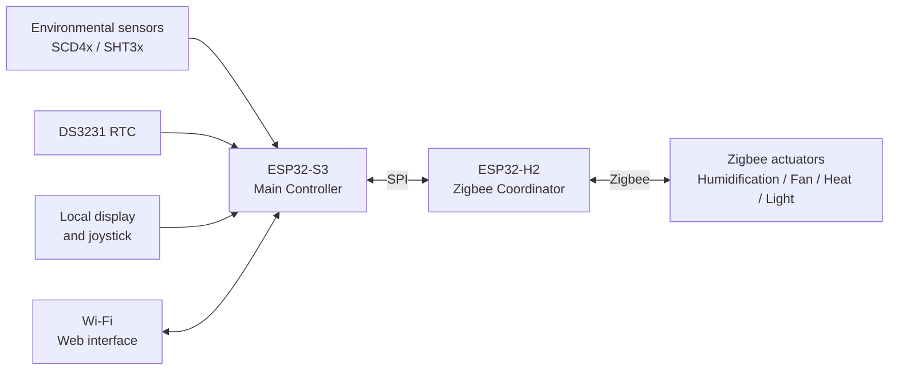

# Hardware Overview

MycoBox is a local environmental-control system built around two ESP32 microcontrollers.

The architecture separates the main automation logic from the Zigbee radio network.

This allows the Main Controller to focus on measurements, schedules and control decisions while a dedicated controller handles communication with external Zigbee devices.

---

# System architecture



---

# ESP32-S3 Main Controller

The ESP32-S3 is the primary application processor.

It is responsible for:

* environmental measurements,
* automation logic,
* Wi-Fi connectivity,
* the local web interface,
* time-based schedules,
* environmental profiles,
* historical data,
* local display operation,
* user input,
* firmware management,
* communication with the Zigbee Controller.

The Main Controller determines when connected equipment should operate.

External mains-powered devices are controlled through Zigbee actuators rather than directly from the ESP32-S3.

---

# ESP32-H2 Zigbee Controller

The ESP32-H2 operates as the Zigbee Coordinator.

Its main responsibilities are:

* maintaining the Zigbee network,
* allowing compatible devices to join,
* tracking paired switch-type devices,
* controlling Zigbee endpoints,
* reporting device state to the Main Controller.

The ESP32-S3 and ESP32-H2 communicate through an internal SPI connection.

This separation allows the Zigbee subsystem to operate independently from the Wi-Fi and application logic.

---

# Environmental sensors

Current MycoBox firmware supports sensors from the:

* Sensirion SCD4x family,
* Sensirion SHT3x family.

Depending on the installed hardware, these sensors provide measurements including:

* temperature,
* relative humidity,
* CO₂ concentration.

The sensor subsystem is connected directly to the Main Controller.

Environmental data is used both for display and automatic control.

---

# Real-time clock

MycoBox uses a DS3231 real-time clock.

Network time can be used as the reference when available, while the RTC provides local time when network synchronization is unavailable.

Reliable time is important for:

* lighting schedules,
* equipment schedules,
* environmental profiles,
* historical measurements,
* daily transitions.

The system can therefore continue time-dependent operation without continuous internet access.

---

# Local user interface

The Main Controller supports a local display and joystick.

This interface allows basic controller information to remain available directly on the device without requiring a phone or computer.

More detailed configuration is performed through the web interface.

---

# Wi-Fi and web interface

The ESP32-S3 provides Wi-Fi connectivity and hosts the MycoBox web interface locally.

A normal browser can be used to:

* monitor environmental measurements,
* review historical data,
* configure control settings,
* configure time-dependent profiles,
* manage Zigbee devices,
* change network settings,
* update firmware.

A cloud service is not required for normal operation.

---

# Zigbee actuators

External equipment is controlled using compatible Zigbee switch-type devices.

Typical actuator hardware includes:

* smart plugs,
* relay modules,
* multi-outlet power strips.

These can be assigned to MycoBox functions such as:

* humidification,
* ventilation,
* lighting,
* heating.

Using external Zigbee switching devices keeps mains-voltage switching physically separate from the Main Controller.

It also allows individual actuators to be replaced without redesigning the controller hardware.

---

# Example installations

The same MycoBox hardware can be adapted to different controlled environments.

```text
Indoor growing enclosure
├── Temperature / humidity sensor
├── Grow light
├── Ventilation fan
└── Humidifier
```

```text
Mushroom fruiting chamber
├── Temperature / humidity / CO₂ sensor
├── Humidifier
├── Fresh-air fan
└── Lighting
```

```text
Terrarium / vivarium
├── Temperature / humidity sensor
├── Heating equipment
├── Lighting
└── Ventilation
```

The required equipment depends on the application.

Not every MycoBox installation needs to use every available control function.

---

# Multi-outlet Zigbee devices

Some Zigbee devices expose several independently controlled endpoints.

For example:

```text
Zigbee power strip
├── Endpoint 1 → Humidifier
├── Endpoint 2 → Fan
├── Endpoint 3 → Light
└── Endpoint 4 → Heating
```

This can reduce the number of separate smart plugs required for an installation.

Endpoint support depends on the implementation used by the Zigbee device.

Always test each endpoint before enabling automatic control.

---

# Firmware components

MycoBox contains two separate firmware components.

```text
ESP32-S3
└── Main Controller firmware

ESP32-H2
└── Zigbee Controller firmware
```

Each controller can be updated independently.

A public release may therefore contain firmware for only one controller or for both.

See:

[Firmware Updates](firmware-update.md)

---

# Related documentation

* [Getting Started](getting-started.md)
* [Zigbee Setup](zigbee.md)
* [Firmware Updates](firmware-update.md)
