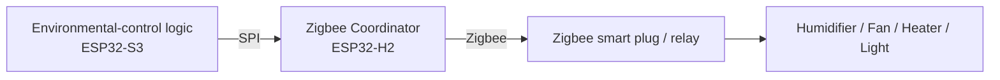

# Zigbee Setup

MycoBox uses Zigbee devices as remote actuators for external environmental-control equipment.

The Zigbee network is managed by the dedicated ESP32-H2 controller operating as the Zigbee Coordinator.

Typical compatible devices include:

* smart plugs,
* single-channel switches,
* relay modules,
* multi-outlet power strips.

These devices can be assigned to MycoBox functions such as:

* humidification,
* ventilation,
* lighting,
* heating.

---

# How Zigbee is used

The ESP32-S3 Main Controller decides when equipment should be switched on or off.

The command is sent through the internal SPI connection to the ESP32-H2 Zigbee Controller, which performs the Zigbee operation.



The Zigbee device itself does not need to know its purpose.

Its role is assigned inside the MycoBox configuration.

---

# Currently supported devices

The current MycoBox firmware supports Zigbee devices that behave as switches.

This includes typical:

* Zigbee smart plugs,
* Zigbee relay modules,
* Zigbee power strips exposing switch endpoints.

Battery-powered Zigbee sensors and other device types are not currently supported by the MycoBox binding system.

Environmental sensors used by MycoBox are connected directly to the Main Controller rather than through Zigbee.

---

# Pairing a new Zigbee device

Open:

**System → Zigbee**

The Zigbee configuration page contains the controls required to add and configure devices.

---

## 1. Open the Zigbee network

Press:

**Open Zigbee Network**

MycoBox allows new Zigbee devices to join the network for:

```text
120 seconds
```

After this time, the network automatically closes for new devices.

Already paired devices continue to operate normally.

Opening or closing the pairing window does not disconnect existing devices.

---

## 2. Put the Zigbee device into pairing mode

Immediately after opening the MycoBox Zigbee network, activate pairing mode on the Zigbee device.

The exact procedure depends on the device manufacturer.

Typical smart plugs may enter pairing mode after:

* holding their button for several seconds,
* performing a factory reset,
* following a specific power-cycle sequence.

Consult the instructions supplied with the Zigbee device if necessary.

The device will usually indicate pairing mode using a flashing LED.

---

## 3. Wait for pairing

Give the device some time to join the network.

After pairing, press:

**Refresh paired devices**

The device should appear in the list.

MycoBox currently displays supported devices using information such as:

```text
Type: switch
IEEE Address: XX:XX:XX:XX:XX:XX:XX:XX
```

The IEEE address uniquely identifies the physical Zigbee device.

Example:

```text
switch
84:FD:27:FF:FE:12:34:56
```

You normally do not need to enter the IEEE address manually.

MycoBox uses it internally when assigning a physical Zigbee device to a control function.

---

# Understanding endpoints

A Zigbee device can contain one or more independently controlled outputs.

Each output is represented by an **endpoint**.

A simple smart plug commonly uses:

```text
Endpoint 1
```

A multi-outlet power strip may expose several independently controlled endpoints.

For example:

```text
IEEE: 84:FD:27:FF:FE:12:34:56

Endpoint 1 → Outlet 1
Endpoint 2 → Outlet 2
Endpoint 3 → Outlet 3
```

The exact endpoint layout depends on the device manufacturer and firmware.

Do not assume that endpoint numbers always match the physical outlet numbers.

Use the MycoBox test controls to identify them.

---

# Current endpoint support

The current MycoBox Zigbee switch controller actively handles switch endpoints:

```text
1 through 6
```

For ordinary single-outlet smart plugs, start with:

```text
Endpoint 1
```

For multi-outlet devices, test the available endpoints individually to determine which endpoint controls each physical outlet.

---

# Testing a device

Before assigning a Zigbee device to automatic control, test it manually.

MycoBox provides **ON** and **OFF** controls on the Zigbee configuration page.

For devices shown in the paired-device list, the quick test currently targets:

```text
Endpoint 1
```

To test another endpoint, use the test controls inside the binding section.

---

## Recommended testing procedure

If possible, connect a harmless and easily observable load.

For example:

* a small lamp,
* another low-power test device.

Then:

1. Select the paired Zigbee device.
2. Enter the endpoint.
3. Press **ON**.
4. Confirm that the expected physical outlet turns on.
5. Press **OFF**.
6. Confirm that the same outlet turns off.

Only after confirming the correct device and endpoint should it be assigned to automatic environmental control.

---

# Binding devices to MycoBox functions

MycoBox currently provides four Zigbee bindings:

| MycoBox function | Purpose                           |
| ---------------- | --------------------------------- |
| **Humidifier**   | Controls humidification equipment |
| **FAE / Fan**    | Controls ventilation equipment    |
| **Light**        | Controls lighting                 |
| **Heatpad**      | Controls heating equipment        |

Each function can be assigned to one Zigbee device and one endpoint.

The names above correspond to the current MycoBox interface.

---

# Example binding configuration

Suppose a Zigbee power strip has the following layout:

```text
IEEE: 84:FD:27:FF:FE:12:34:56

Endpoint 1 → Humidifier
Endpoint 2 → Fan
Endpoint 3 → Light
Endpoint 4 → Heater
```

The same Zigbee device can then be used for several MycoBox functions:

```text
Humidifier
Device:   84:FD:27:FF:FE:12:34:56
Endpoint: 1

FAE / Fan
Device:   84:FD:27:FF:FE:12:34:56
Endpoint: 2

Light
Device:   84:FD:27:FF:FE:12:34:56
Endpoint: 3

Heatpad
Device:   84:FD:27:FF:FE:12:34:56
Endpoint: 4
```

This allows one compatible multi-outlet Zigbee device to control several pieces of equipment.

---

# Creating a binding

Open:

**System → Zigbee → Bind devices**

Select the function you want to configure:

* Humidifier
* FAE / Fan
* Light
* Heatpad

Then:

1. Select the Zigbee device by its IEEE address.
2. Enter the endpoint number.
3. Use **Test Outlet → ON**.
4. Confirm that the correct physical device starts.
5. Use **Test Outlet → OFF**.
6. Confirm that it stops.
7. Press **Save binding**.

The binding is stored in the MycoBox configuration.

From that point, the corresponding environmental-control function can operate the assigned Zigbee outlet.

---

# Removing a binding

A device can be detached from a MycoBox function without removing it from the Zigbee network.

In the appropriate binding section:

1. Select **(not bound)** or clear the endpoint.
2. Press **Save binding**.

The selected MycoBox function will no longer control that Zigbee outlet.

The Zigbee device itself remains paired to the Zigbee network.

---

# Paired device vs. binding

Pairing and binding are two different concepts.

## Paired device

A paired device belongs to the MycoBox Zigbee network.

```text
MycoBox Zigbee network
        │
        └── Smart plug
```

Pairing establishes Zigbee communication with the device.

---

## Binding

A MycoBox binding defines what the paired device and endpoint are used for.

```text
Smart plug + Endpoint 1
        │
        └── Humidifier
```

A device may therefore be:

* paired but not assigned to any MycoBox function,
* paired and assigned to one function,
* assigned to several functions using different endpoints.

---

# Using multi-outlet power strips

Multi-outlet Zigbee power strips can be especially useful with MycoBox.

Instead of using several separate smart plugs:

```text
Humidifier → Plug A
Fan        → Plug B
Light      → Plug C
Heater     → Plug D
```

a compatible power strip may provide:

```text
Power strip
├── Endpoint 1 → Humidifier
├── Endpoint 2 → Fan
├── Endpoint 3 → Light
└── Endpoint 4 → Heater
```

Compatibility depends on how the manufacturer exposes the individual outlets through Zigbee.

Endpoint numbering is not standardized across all devices.

Always test each endpoint before assigning it.

---

# Safety when testing outlets

Zigbee pairing and testing can physically switch connected equipment.

Before pressing **ON**, verify:

* which Zigbee device is selected,
* which endpoint is selected,
* what equipment is connected to the outlet.

Be especially careful with:

* heaters,
* heating mats,
* high-power humidifiers,
* pumps,
* fans,
* equipment containing moving parts.

Never repeatedly switch equipment that is not designed for rapid power cycling.

The connected load must remain within the electrical ratings of the Zigbee smart plug, relay or switching device.

For additional guidance, see:

[Safety](safety.md)

---

# If a device does not appear

If a newly paired device is not shown after pressing **Refresh paired devices**:

1. Verify that the device is actually in pairing mode.
2. Open the Zigbee network again.
3. Move the device closer to MycoBox during initial pairing.
4. Factory-reset the Zigbee device according to its manufacturer's instructions.
5. Try the pairing process again.

Also remember that the current MycoBox interface is intended for supported switch-type devices.

A joined Zigbee device using an unsupported device type or implementation may therefore not be usable through the current binding interface.

---

# If ON/OFF does not work

First verify the endpoint.

For a simple smart plug, try:

```text
Endpoint 1
```

For a multi-outlet device, test the supported endpoints one by one.

The current switch controller supports:

```text
Endpoints 1 through 6
```

If the device appears in the paired list but none of the supported endpoints operates it, the device may use a Zigbee implementation that is not currently compatible with the MycoBox switch controller.

---

# Quick test always controls endpoint 1

The ON/OFF buttons shown directly in the paired-device list currently target:

```text
Endpoint 1
```

This is convenient for ordinary single-outlet smart plugs.

For devices using other endpoints, use the test controls inside the appropriate binding section.

---

# Forgetting all Zigbee devices

MycoBox provides a Zigbee network reset function:

**Forget paired devices**

This operation resets the Zigbee network maintained by the ESP32-H2.

Use it only when you intentionally want to rebuild the Zigbee network.

After the reset:

* previously paired devices are removed from the MycoBox Zigbee network,
* the Zigbee Controller restarts,
* devices must be paired again before they can be used,
* MycoBox bindings should be reviewed and tested again.

> This is different from removing a binding. Removing a binding leaves the Zigbee network and paired devices intact.

It is also separate from the Main Controller factory reset described in the troubleshooting documentation.

---

# Zigbee Controller firmware

The Zigbee page also provides firmware information and update controls for the ESP32-H2 Zigbee Controller.

Updating the Zigbee Controller firmware is a maintenance operation and should not be confused with pairing or binding devices.

Do not disconnect power while the ESP32-H2 firmware is being updated.

An H2 firmware update rewrites the Zigbee Controller firmware and requires the Zigbee devices to be paired again afterwards.

After an H2 update:

1. Wait for the Zigbee Controller to restart.
2. Open the Zigbee network.
3. Pair the required devices again.
4. Refresh the paired-device list.
5. Identify the correct endpoints.
6. Review all MycoBox bindings.
7. Test every controlled output.

See:

[Firmware Updates](firmware-update.md)

for the complete update procedure.

---

# Recommended installation workflow

For a new installation, configure Zigbee in this order:

```text
1. Pair all required Zigbee devices
        ↓
2. Refresh the paired-device list
        ↓
3. Identify each physical device
        ↓
4. Identify the correct endpoint
        ↓
5. Test ON / OFF
        ↓
6. Create the MycoBox binding
        ↓
7. Test the binding again
        ↓
8. Enable automatic control
```

Do not enable unattended automatic control before all actuator assignments have been verified.

---

# Example complete configuration

A typical installation may use separate Zigbee smart plugs:

```text
SCD4x / SHT3x
      │
      ▼
   MycoBox
      │
      └── Zigbee
            │
            ├── Smart Plug A
            │      └── Humidifier
            │
            ├── Smart Plug B
            │      └── Ventilation Fan
            │
            ├── Smart Plug C
            │      └── Light
            │
            └── Smart Plug D
                   └── Heating Mat
```

or one compatible multi-outlet device:

```text
MycoBox
   │
   └── Zigbee Power Strip
          ├── Endpoint 1 → Humidifier
          ├── Endpoint 2 → Fan
          ├── Endpoint 3 → Light
          └── Endpoint 4 → Heatpad
```

Once the bindings are configured, the MycoBox control logic operates logical functions instead of directly addressing physical devices.

---

# Troubleshooting Zigbee

Common problems include:

* a device not entering pairing mode,
* the device using an unexpected endpoint,
* a multi-outlet device exposing outlets differently than expected,
* the device being paired but not assigned to a MycoBox function,
* an unsupported Zigbee switch implementation.

Start by checking whether the device can be operated manually from the Zigbee page.

If manual ON/OFF control does not work, troubleshoot the Zigbee device or endpoint before investigating automatic environmental-control settings.

For additional troubleshooting, see:

[Troubleshooting](troubleshooting.md)

---

# Related documentation

* [Getting Started](getting-started.md)
* [Hardware Overview](hardware-overview.md)
* [Firmware Updates](firmware-update.md)
* [Troubleshooting](troubleshooting.md)
* [Safety](safety.md)
