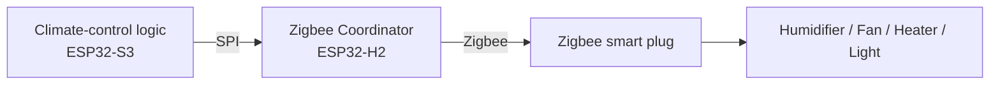

# Zigbee Setup

MycoBox uses Zigbee devices as remote actuators for equipment inside the growing chamber.

The Zigbee network is managed by the dedicated ESP32-H2 controller operating as the Zigbee Coordinator.

Typical Zigbee devices include:

* smart plugs,
* single-channel switches,
* multi-outlet power strips.

These devices can then be assigned to MycoBox functions such as:

* humidifier,
* fresh-air exchange fan,
* lighting,
* heating.

---

## How Zigbee is used

The ESP32-S3 decides when equipment should be switched on or off.

The command is then sent to the ESP32-H2, which performs the actual Zigbee operation.



The Zigbee device itself does not need to know its purpose.

Its function is assigned inside MycoBox.

---

## Currently supported devices

The current MycoBox firmware supports Zigbee devices that behave as switches.

This includes typical:

* Zigbee smart plugs,
* Zigbee relay modules,
* Zigbee power strips exposing switch endpoints.

Battery-powered Zigbee sensors and other device types are not currently supported by the MycoBox binding system.

The environmental sensors used for climate control are connected directly to the Main Controller.

---

# Pairing a new Zigbee device

Open:

**System → Zigbee**

The Zigbee configuration page contains the controls required to add and configure devices.

## 1. Open the Zigbee network

Press:

**Open Zigbee Network**

MycoBox will allow new Zigbee devices to join the network for:

**120 seconds**

After this time the network automatically closes for new devices.

Already paired devices continue to operate normally.

Opening or closing the pairing window does not disconnect existing devices.

---

## 2. Put the Zigbee device into pairing mode

Immediately after opening the MycoBox Zigbee network, activate pairing mode on the Zigbee device.

The exact procedure depends on the device manufacturer.

Typical smart plugs enter pairing mode after:

* holding their button for several seconds,
* performing a factory reset,
* or following a specific power-cycle sequence.

Consult the instructions supplied with the Zigbee device if necessary.

The device should normally indicate pairing mode using a flashing LED.

---

## 3. Wait for pairing

Give the device some time to join the network.

After pairing, press:

**Refresh paired devices**

The device should appear in the list.

MycoBox currently displays supported devices as:

```text
Type: switch
IEEE Address: XX:XX:XX:XX:XX:XX:XX:XX
```

The IEEE address is the unique Zigbee identifier of the physical device.

Example:

```text
switch
84:FD:27:FF:FE:12:34:56
```

You normally do not need to enter this address manually.

MycoBox uses it internally when assigning a device to a chamber function.

---

# Understanding endpoints

A Zigbee device can contain one or more independently controlled outputs.

Each output is represented by an **endpoint**.

A simple smart plug commonly uses:

```text
Endpoint 1
```

A multi-outlet power strip may expose several independently controlled endpoints.

For example:

```text
IEEE: 84:FD:27:FF:FE:12:34:56

Endpoint 1 → Outlet 1
Endpoint 2 → Outlet 2
Endpoint 3 → Outlet 3
```

The exact endpoint layout depends on the device.

Do not assume that outlet numbers and endpoint numbers always match.

Use the MycoBox test controls to identify them.

---

## Current endpoint support

The current Zigbee switch controller actively handles switch endpoints **1 through 6**.

For ordinary single-outlet smart plugs, start with:

```text
Endpoint 1
```

For multi-outlet devices, test the available endpoints individually to determine which endpoint controls which physical outlet.

---

# Testing a device

Before assigning a device to automatic climate control, test it manually.

On the Zigbee page, MycoBox provides **ON** and **OFF** controls.

For devices shown in the paired-device list, the quick test targets endpoint 1.

For other endpoints, use the test controls inside the binding section.

## Recommended procedure

Connect a harmless, easily observable load if possible.

For example:

* a small lamp,
* another low-power test device.

Then:

1. Select the paired Zigbee device.
2. Enter the endpoint.
3. Press **ON**.
4. Confirm that the expected physical outlet turns on.
5. Press **OFF**.
6. Confirm that the same outlet turns off.

Only after confirming the correct device and endpoint should it be assigned to climate automation.

---

# Binding devices to chamber functions

MycoBox currently provides four Zigbee bindings:

| MycoBox function | Purpose                                   |
| ---------------- | ----------------------------------------- |
| **Humidifier**   | Controls humidification equipment         |
| **FAE (Fan)**    | Controls fresh-air exchange / ventilation |
| **Light**        | Controls chamber lighting                 |
| **Heatpad**      | Controls heating equipment                |

Each function can be assigned to one Zigbee device and one endpoint.

---

## Example

Suppose a Zigbee power strip has the following layout:

```text
IEEE: 84:FD:27:FF:FE:12:34:56

Endpoint 1 → Humidifier
Endpoint 2 → Fan
Endpoint 3 → Light
Endpoint 4 → Heater
```

The same Zigbee device can then be used for several MycoBox functions:

```text
Humidifier
Device:   84:FD:27:FF:FE:12:34:56
Endpoint: 1

FAE (Fan)
Device:   84:FD:27:FF:FE:12:34:56
Endpoint: 2

Light
Device:   84:FD:27:FF:FE:12:34:56
Endpoint: 3

Heatpad
Device:   84:FD:27:FF:FE:12:34:56
Endpoint: 4
```

This allows one multi-outlet Zigbee power strip to control several pieces of chamber equipment.

---

# Creating a binding

Open:

**System → Zigbee → Bind devices**

Select the function you want to configure:

* Humidifier
* FAE (Fan)
* Light
* Heatpad

Then:

1. Select the Zigbee device by its IEEE address.
2. Enter the endpoint number.
3. Use **Test Outlet → ON**.
4. Confirm that the correct physical device starts.
5. Use **Test Outlet → OFF**.
6. Confirm that it stops.
7. Press **Save binding**.

The binding is stored in the MycoBox configuration.

From that point, the corresponding climate-control module can operate the assigned Zigbee outlet.

---

# Removing a binding

A device can be detached from a MycoBox function without removing it from the Zigbee network.

In the appropriate binding section:

1. Select **(not bound)**

or clear the endpoint,

then press:

**Save binding**

The selected MycoBox function will no longer control that Zigbee outlet.

The Zigbee device itself remains paired to MycoBox.

---

# Paired device vs. binding

These are two different concepts.

## Paired

A paired device belongs to the MycoBox Zigbee network.

```text
MycoBox Zigbee network
        │
        └── Smart plug
```

## Bound

A binding tells the climate-control system what the device is used for.

```text
Smart plug + Endpoint 1
        │
        └── Humidifier
```

A device may therefore be:

* paired but not assigned,
* paired and assigned,
* assigned to several functions using different endpoints.

---

# Using power strips

Multi-outlet Zigbee power strips can be especially useful with MycoBox.

Instead of using four separate smart plugs:

```text
Humidifier → Plug A
Fan        → Plug B
Light      → Plug C
Heater     → Plug D
```

a compatible power strip can potentially provide:

```text
Power strip
├── Endpoint 1 → Humidifier
├── Endpoint 2 → Fan
├── Endpoint 3 → Light
└── Endpoint 4 → Heater
```

Compatibility depends on how the manufacturer exposes the individual outlets through Zigbee.

Always test each endpoint before assigning it.

---

# Safety when testing outlets

Zigbee pairing and testing can physically switch connected equipment.

Before pressing **ON**, verify what is connected to the selected outlet.

Be especially careful with:

* heaters,
* heating mats,
* high-power humidifiers,
* pumps,
* fans,
* equipment containing moving parts.

Never repeatedly switch equipment that is not designed for rapid power cycling.

The electrical load must remain within the ratings of the Zigbee smart plug or switching device.

---

# If a device does not appear

If a newly paired device is not shown after pressing **Refresh paired devices**:

1. Verify that the device is actually in pairing mode.
2. Open the Zigbee network again.
3. Move the device closer to MycoBox during initial pairing.
4. Factory-reset the Zigbee device according to its manufacturer's instructions.
5. Try the pairing process again.

Also remember that the current MycoBox interface only lists supported switch-type devices.

A successfully joined but unsupported Zigbee device may therefore not be usable through the current binding interface.

---

# If ON/OFF does not work

First verify the endpoint.

For a single smart plug, try:

```text
Endpoint 1
```

For a multi-outlet device, try the available endpoints one by one.

If the device appears in the paired list but no tested endpoint operates it, the device may use a Zigbee implementation that is not currently compatible with the MycoBox switch controller.

---

# Forgetting all Zigbee devices

MycoBox provides a Zigbee network reset function:

**Forget paired devices**

This operation resets the Zigbee network maintained by the ESP32-H2.

Use it only when you intentionally want to rebuild the Zigbee network.

After the reset:

* previously paired devices are removed from the MycoBox Zigbee network,
* the Zigbee Controller restarts,
* devices must be paired again before they can be used.

Individual bindings should be reviewed after rebuilding the Zigbee network.

> This is different from simply removing a binding. Removing a binding leaves the Zigbee network intact.

---

# Zigbee Controller firmware

The Zigbee page also provides firmware information and update controls for the ESP32-H2 Zigbee Controller.

Updating the Zigbee Controller firmware is a maintenance operation and should not be confused with pairing devices.

Do not disconnect power while the Zigbee Controller firmware is being updated.

Depending on the update procedure, the Zigbee network may need to be rebuilt afterwards.

See:

[Firmware Updates](firmware-update.md)

for the complete update procedure.

---

# Recommended installation workflow

For a new chamber, configure Zigbee in this order:

```text
1. Pair all Zigbee devices
        ↓
2. Refresh the paired-device list
        ↓
3. Identify each physical device
        ↓
4. Identify the correct endpoint
        ↓
5. Test ON / OFF
        ↓
6. Create the MycoBox binding
        ↓
7. Test again
        ↓
8. Enable automatic climate control
```

Do not enable unattended automatic control before all actuator assignments have been verified.

---

# Example complete configuration

A typical chamber could use:

```text
SCD4x / SHT3x
      │
      ▼
   MycoBox
      │
      └── Zigbee
            │
            ├── Smart Plug A
            │      └── Humidifier
            │
            ├── Smart Plug B
            │      └── Exhaust Fan
            │
            ├── Smart Plug C
            │      └── Light
            │
            └── Smart Plug D
                   └── Heating Mat
```

or a compatible multi-outlet device:

```text
MycoBox
   │
   └── Zigbee Power Strip
          ├── Endpoint 1 → Humidifier
          ├── Endpoint 2 → Fan
          ├── Endpoint 3 → Light
          └── Endpoint 4 → Heatpad
```

Once the bindings are configured, cultivation logic operates the logical functions instead of directly addressing physical devices.

---

## Related documentation

* [Getting Started](getting-started.md)
* [Hardware Overview](hardware-overview.md)
* [User Guide](user-guide.md)
* [Cultivation Cycles](cultivation-cycle.md)
* [Firmware Updates](firmware-update.md)
* [Troubleshooting](troubleshooting.md)
